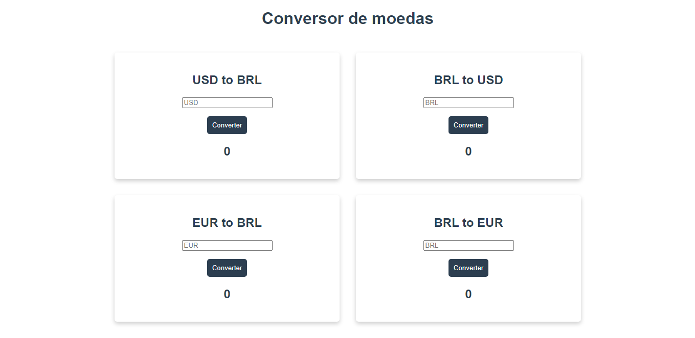

# Conversor Vue

<p align="center" >
  
</p>

## 💻 Projeto
O projeto se trata de um conversor de moedas utilizando somente o Vue.js e uma API de conversão.

## 🚀 Tecnologias utilizadas
* Vue Js
* API Currency Converter


## Project setup
```
npm install
```

### Compiles and hot-reloads for development
```
npm run serve
```

### Compiles and minifies for production
```
npm run build
```

### Lints and fixes files
```
npm run lint
```


